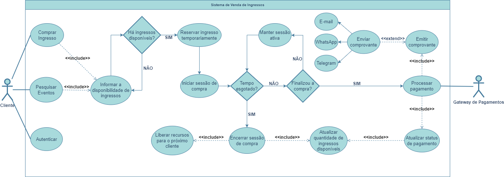
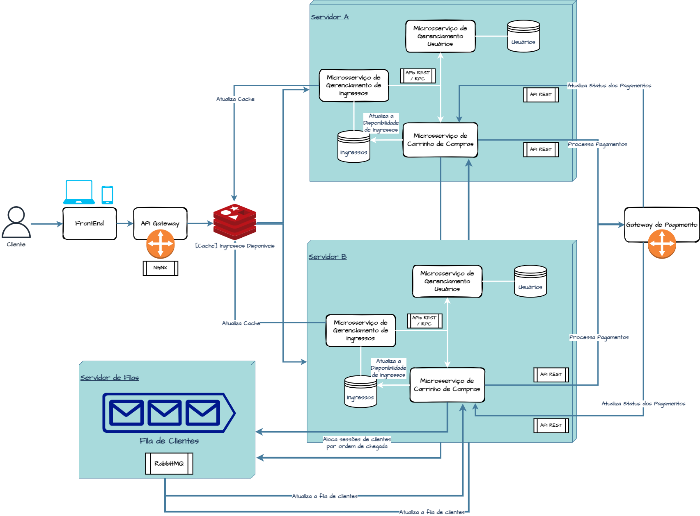

# BigDataCorp Challenge

Solução para o desafio de arquitetura da BigDataCorp.

## Contextualização
Para atender aos requisitos, a estrutura de software do sistema de ingressos deve atender às seguintes restrições:
- Permitir que um cliente com uma **conexão de internet mais lenta** possa comprar um ingresso sem maiores problemas da mesma forma que um cliente com uma **conexão de internet mais rápida**;
- Permitir a compra **somente** da quantidade de ingressos disponíveis no sistema.

## Solução
O sistema deverá implementar um sistema de filas. Deve ser responsável por gerenciar o acesso dos clientes ao sistema, garantindo que apenas os clientes que realmente tenham ingressos disponíveis possam finalizar a compra e garante que clientes com conexão de internet mais lentas possam comprar normalmente e sem risco de perder a vez para alguém com uma conexão de internet mais rápida.

A estrutura de filas pode ser implementada de forma centralizada ou distribuída:
- **Implementação centralizada:** todas as filas são gerenciadas por um único servidor. Esta abordagem é mais simples de implementar, mas pode ter um desempenho limitado, pois o servidor central pode ficar sobrecarregado com o grande número de acessos;
- **Implementação distribuída:** cada fila é gerenciada por um servidor separado. Aqui pode ser um pouco mais complexo de implementar, mas oferece um desempenho melhor, já que os servidores podem distribuir o tráfego entre todas as instâncias.

## Representação
O seguinte diagrama representa o fluxo de funcionamento do sistema:

- Um cliente interessado em adquirir o ingresso do show pode iniciar a interação com o sistema pesquisando por ingressos de shows disponíveis;
- O cliente inicia o processo de compra de um ingresso;
- O sistema verifica a disponibilidade de ingressos;
	- Caso **positivo**, o sistema reserva um ingresso e recursos de sessão no servidor para que este cliente possa finalizar o processo de compra dentro de um tempo determinado;
	- Caso **negativo**, o sistema informa o cliente sobre a indisponibilidade de compra e encerra o processo.
- O processamento dos pagamentos é transferido para um **Gateway de pagamentos**, onde este também é responsável por atualizar o status do pagamento conforme o progresso da transação;
- Se esgotar o tempo de sessão do cliente ou a compra for finalizada, o sistema encerra a sessão, atualiza a quantidade de ingressos disponíveis e libera recursos do servidor para que o próximo cliente da fila possa iniciar o processo de compra;
- O sistema emite o comprovante da compra e o envia para o cliente através de e-mail, aplicativos de mensagem, SMS, notificação push, etc.

O sistema também pode ser representado na ilustração abaixo, mostrando os aspectos mais técnicos das tecnologias envolvidas neste sistema:

A arquitetura deste sistema pode ser construída com microsserviços, onde cada microsserviço é responsável por uma função no sistema: gerenciamento dos ingressos, gerenciamento dos usuários e do carrinho de compras e se comunicam entre si por APIs REST ou RPC.

Para garantir robustez do sistema, o tráfego pode ser distribuído entre as instâncias do sistema por uma API Gateway, assim o servidor principal não ficará sobrecarregado, a função de gerenciar os clientes que irão comprar ficará em um servidor de filas e um cache na ponta para deixar o processo ainda mais rápido.

O processo de pagamento é delegado para um Gateway de pagamentos (Stripe, PagSeguro, PayPal, etc).

Ao final do processo, o servidor libera os recursos para os próximos clientes da fila.